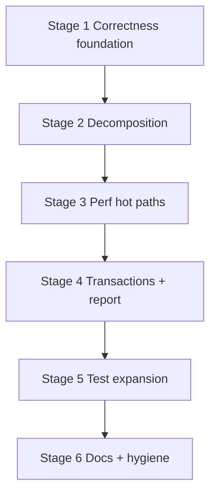

# Backend Improvement Plan

## Context

**Target scale:** LAN, 1–5 users, &lt;10k documents per collection.  
**Contract rule:** list pagination is **additive only** (`limit`/`cursor` optional; default stays unbounded until frontend migrates).  
**Frontend:** out of scope unless a backend contract change requires a tiny consumer note.

**Stack today:** Express 5 → `routes/` → `domain/*/service` → Mongoose models → MongoDB (replica set). Auth: opaque Bearer tokens on `Employee`, global `requireAuthUnlessPublic`, route-level RBAC.

**Baseline (Stage 4 complete):** helmet, auth gate, demo prod block, integration smoke tests, Docker health with `version`/`buildSha`, ~240 backend tests.

## Goals

| Focus | Outcome |
|-------|---------|
| **Correctness** | Domain errors → correct HTTP status; multi-doc writes safe under concurrency |
| **Decomposition** | Split god services; thin routes; no behavior change |
| **Performance** | Fix hot-path N+1 / write-on-read; indexes; cheap auth path |
| **Tests** | Close domain gaps; expand integration matrix; grow coverage allow-list carefully |

## Current pain points (audit)

### God modules

| File | ~LOC | Issue |
|------|------|--------|
| `domain/sale/service.ts` | ~1840 | create/update/workspace/payment/return/stock in one file |
| `domain/finance/service.ts` | ~960 | cashboxes + currencies + txs + report |
| `shared/lib/parsers.ts` | ~700 | all payload normalizers |
| `domain/supplier-order/service.ts` | ~625 | list side-effects + take-on-charge bulk |
| `routes/sale.routes.ts` | ~230 | workspace-diff + permission branching |

### Correctness

- Sale (and many domains) throw plain `Error` → API returns **500** for not-found / validation.
- Transactions almost only in `finance/service.ts`; sale stock + supplier pay/receive are multi-step without session.
- `getFinanceReport` reuses last **100** transactions → wrong totals under load.

### Performance (even at LAN scale)

- **N+1:** `listCatalogProducts`, `listClientDevices` (usage counts), `listSupplierOrders` (supplier name).
- **Unbounded fat lists:** `listSales` loads full documents (timeline, payments, lineItems).
- **Write-on-read:** `listSupplierOrders` runs reconcile/overdue mutations every GET.
- **Double auth DB hit:** middleware loads `req.employee`, then `requirePermission*` reloads by token.
- Weather has no cache; market rates already TTL-cached.

### Tests

| Strong | Weak / missing |
|--------|----------------|
| sale create/workspace/payment/return, supplier-order cancel/closure/stock, finance cancel/currency, backup, client phones/excel, parsers | demo, sequence, service-catalog, supplier CRUD, most routes, SO `update` suite skipped, finance report/list, full auth middleware |

Coverage gate is **100% on allow-list only** (`env`, `client/constants`, `sale/stock`). Expand only with full branch tests.



---

## Stage 1 — Correctness foundation

**Goal:** right HTTP statuses + single employee load per request. No public API shape change.

### 1.1 HttpError standardization (sale first)

- `shared/lib/query.ts` `isValidObjectIdOrThrow` → `HttpError(400)`.
- `domain/sale/validators.ts` + `domain/sale/service.ts`: replace `throw new Error` with:
  - **404** — not found (sale, product, client, line item, employee inactive)
  - **403** — employee lacks field permissions
  - **400** — validation, stock, payment/refund rules, serial constraints
- Follow-up modules (same stage or 1.x): `product`, `client`, `supplier-order` plain `Error` → `HttpError`.

### 1.2 Use `req.employee`

- `shared/lib/http.ts`: `requirePermission` / `requireAnyPermission` / `requireOwner` use `req.employee` when set; fallback to token lookup.
- `sale.routes.ts`: prefer `requirePermission` / `requireAnyPermission` over bare `requirePermissionByToken` when request is already authenticated.

### 1.3 Done when

- Backend `npm test` green.
- Manual/supertest: invalid ObjectId / sale not found → 400/404, not 500.
- Auth permission path does not call `Employee.findOne` twice when middleware already ran.

**Out of scope Stage 1:** service file splits, pagination, new indexes.

---

## Stage 2 — Decomposition (behavior-preserving)

### 2.1 Split `sale` domain

```text
domain/sale/
  service.ts              # re-exports public API (stable imports)
  list.ts                 # listSales, favorite
  create.ts               # createSale + rapid sale
  update.ts               # updateSale, updateSaleWorkspace
  payment.ts              # acceptSalePayment, refundSalePayment
  return.ts               # return* helpers
  stock-ops.ts            # ensureFreeStock, applyStockDeltas (or keep in stock.ts)
  internal.ts             # shared helpers / snapshots
```

- Move workspace permission heuristics from `sale.routes.ts` into domain (`workspace-permissions.ts` or `update.ts`).
- Keep route file thin: parse → auth → service → json.

### 2.2 Split `finance` domain

```text
domain/finance/
  service.ts              # re-exports
  cashboxes.ts
  currencies.ts
  transactions.ts
  report.ts
  session.ts              # withOptionalFinanceSession
```

### 2.3 Split `shared/lib/parsers.ts` by domain

`parsers/sale.ts`, `parsers/client.ts`, `parsers/product.ts`, … + barrel `parsers/index.ts` (or keep `parsers.ts` re-export for stable imports).

### 2.4 Done when

- No intentional behavior change; all existing tests pass without rewrite of business assertions.
- Import paths from routes stay stable (`from '../domain/sale/service'`).

---

## Stage 3 — Performance hot paths (LAN-relevant)

**Pagination policy:** optional `limit`/`offset` or `cursor`; **default = full list** (current contract).

| Priority | Work |
|----------|------|
| P0 | Eliminate N+1 in `listCatalogProducts` / `listClientDevices` (aggregate counts in 1–2 queries) |
| P0 | Batch supplier names in `listSupplierOrders` / accounting queue (`$in` or populate) |
| P0 | Stop write-on-read in `listSupplierOrders`: move reconcile/overdue to scheduler or explicit admin/job endpoint; list stays read-only |
| P1 | Optional projection for `listSales` (lighter list DTO) + optional limit; keep full GET-by-id fat card |
| P1 | Indexes: `Sale.saleDate`, `Sale.kind`, useful supplier-order `deliveryDate` |
| P1 | Weather in-memory TTL cache (mirror market rates) |
| P2 | Serial reserve / take-on-charge batch inserts where safe |
| P2 | Cap backup restore upload default lower than 10gb in docs/env example (ops safety) |

**Skip for this plan:** Redis, GraphQL, full-text Atlas search.

---

## Stage 4 — Transactions + finance report correctness

| Path | Action |
|------|--------|
| Sale create/update with stock | `withTransaction` when stock deltas apply (replica set already required) |
| `paySupplierOrder` / issue-without-payment | finance + order status one session |
| `takeOnChargeSupplierOrder` | product inserts + order update in session (or compensating design documented) |
| `mergeClients` | session around delete + updateMany |
| `getFinanceReport` | query by date range / aggregate, **not** last-100 list |

Keep manual rollback helpers only as fallback when session unavailable (dev without RS) — prefer fail-loud if RS missing in production.

---

## Stage 5 — Test expansion

### 5.1 Unblock / fill domain suites

- Unskip / rewrite `supplier-order/service.update.test.ts`.
- Implement `catalog-product/service.test.ts` (drop `it.todo`).
- Unit: `demo/service` seed/erase guards; `sequence/service`; `service-catalog`; `supplier` CRUD edges.
- Sale: `deleteSale`, favorite, non-workspace `updateSale` paths still thin.

### 5.2 HTTP / integration

Extend `api.integration.test.ts` (or domain route tests):

- Permission matrix samples: finance write, supplier-order manage, backup, warehouse-settings.
- Sale not-found → 404 after Stage 1.
- Full `requireAuthUnlessPublic` unit (401 invalid token already partly covered).

### 5.3 Coverage allow-list

Add modules only with 100% branch tests, order:

1. Pure helpers already near-complete (`status-resolver`, `totals`, finance `validators`)
2. `sale/validators.ts` after HttpError
3. Later: thin extracted modules from Stage 2 — **not** entire 1800-line service in one go

### 5.4 Optional later

True Mongo integration suite behind `npm run test:mongo` (not required for CI default).

---

## Stage 6 — Documentation + hygiene

| Doc | Update |
|-----|--------|
| This file | Check off stages as done |
| `ARCHITECTURE.md` | Reflect tests exist; domain layout after splits; transactions policy |
| `TESTING.md` | New suites, coverage allow-list growth, integration matrix |
| `API.md` | Error status conventions; optional list query params; report semantics |
| `PROJECT_STRUCTURE.md` | Full domain list (supplier-order, catalog-product, warehouse, market, weather, backup) |
| `SECURITY.md` | Note single employee load; no change to LAN threat model |
| `DEPLOYMENT.md` | RS required for multi-doc transactions |

Hygiene (low risk):

- Drop odd `"project_goods": "file:.."` backend dependency if unused.
- Deduplicate `client-phones` / `supplier-phones` if still near-identical.

---

## Execution order & risk

| Stage | Risk | FE impact | Est. effort |
|-------|------|-----------|-------------|
| 1 Correctness | Low–med (status code changes may affect FE error UI positively) | None if messages unchanged | S |
| 2 Decomposition | Med (merge conflicts, import churn) | None | M–L |
| 3 Perf | Med (list side-effect removal needs job for overdue) | Additive query params only | M |
| 4 Transactions | Med–high (must test race paths) | None | M |
| 5 Tests | Low | None | M |
| 6 Docs | Low | None | S |

## Non-goals (this plan)

- Public internet SaaS hardening (rate limits, JWT, token hashing) — see `SECURITY.md` backlog
- Frontend god-component splits
- Shared Zod schema monorepo package (optional later)
- Live Mongo in default CI

## Progress log

| Date | Stage | Notes |
|------|-------|-------|
| 2026-07-12 | Plan | Audit complete; stages defined |
| 2026-07-12 | Stage 1 | **Done:** sale HttpError (404/403/400), `isValidObjectIdOrThrow` 400, `requirePermission*` uses `req.employee`, sale routes use shared helpers; backend **242 tests** green |
| 2026-07-12 | Stage 2 (sale) | **Done:** `sale/service.ts` → `internal`, `list`, `create`, `update`, `payment`, `return` + barrel; workspace helpers → `workspace-permissions.ts` |
| 2026-07-12 | Stage 2 (finance) | **Done:** `finance/service.ts` → `internal`, `cashboxes`, `currencies`, `transactions` + barrel; **242 tests** green. Parsers split still pending (optional). |
| 2026-07-12 | Stage 3 | **Done:** catalog/device list usage counts = 1 sales load (no N+1); SO list read-only + batch supplier names; `refreshSupplierOrderDerivedStatuses` on startup; Sale `saleDate`/`kind` + SO `deliveryDate` indexes; weather 15m TTL cache; **242 tests** green |
| 2026-07-12 | Stage 4 | **Done:** `getFinanceReport` full counts + today by business day (not last-100); sale create/update/workspace/delete stock+sale via `withOptionalMongoSession`; `createFinanceTransaction` accepts external session; `paySupplierOrder` atomic with finance; `mergeClients` transactional; take-on-charge multi-insert TX deferred. |
| 2026-07-12 | Stage 5 | **Done:** SO update/favorite tests; catalog list/delete usage; sequence service; demo erase/seed; integration 403 matrix + sale 404; coverage allow-list + `sequence/service`; **261 tests** green |
| 2026-07-12 | Stage 6 | Docs: TESTING.md + plan log updated with Stage 5; ARCHITECTURE already has TX/perf notes |
