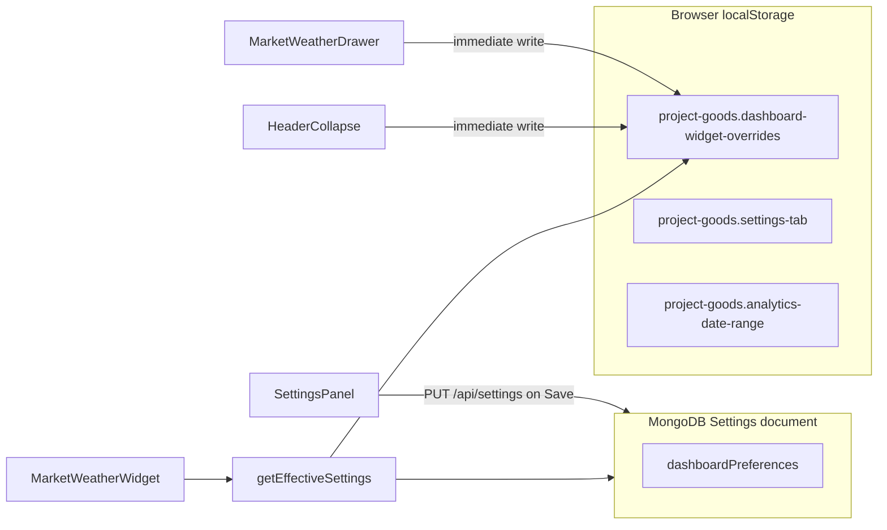

# Business Dashboard (Home Page)

The business home page is the default dashboard view (`page=home`). It is rendered by `AnalyticsHeroSection` and focuses on operational KPIs, comparative charts, and live market/weather insights.

## UI entry points

- Main component: `frontend/src/widgets/dashboard/ui/analytics/AnalyticsHeroSection.tsx`
- Page host: `frontend/src/pages/dashboard/ui/DashboardPage.tsx`
- Analytics engine: `frontend/src/widgets/dashboard/model/sales-analytics.ts`
- Market & weather widget: `frontend/src/widgets/dashboard/ui/weather/MarketWeatherWidget.tsx`

## Header controls

### Period presets

Quick period toggles remain available:

- Whole (all-time, leftmost)
- Today (default)
- This month
- Last month
- This year
- Last year

Preset buttons filter sales and repair-order analytics through `buildDashboardAnalytics()`.

- **Whole** — all product sales and repair orders in the database; charts use a single yearly series from the earliest record year through the current year (no year-over-year overlay).
- **Today** — selected by default on first load.

### Date filter (replaces Export)

The old **Export** action was removed from the business home page. Product export remains available in warehouse and clients modules.

Instead, a **Date** button opens a calendar range panel (same interaction model as accounting date filters):

- `dateFrom` / `dateTo` inputs
- Apply / Clear actions
- Active filter badge on the button

When a custom date range is applied:

- It overrides preset period toggles for all KPIs and charts
- The selected range is persisted in `localStorage` (`project-goods.analytics-date-range`)
- Charts switch to a single-series mode (no year-over-year overlay)
- Bucketing adapts to range length:
  - `<= 1 day` → hourly buckets
  - `2–62 days` → daily buckets
  - `> 62 days` → monthly buckets

Related files:

- `frontend/src/widgets/dashboard/ui/analytics/AnalyticsDateFilterPanel.tsx`
- `frontend/src/widgets/dashboard/model/analytics-date-range.ts`

## Market & Weather widget

A responsive insights block (**Live insights**) is shown at the **top of the home page**, above the Executive dashboard header, when enabled in settings.

### Header collapse (quick toggle)

Clicking the **Live insights / Market & weather** header toggles the widget body (exchange rates + weather panels):

- First click → collapse (header, chevron, Refresh, and Settings remain)
- Second click → expand
- State persists in browser `localStorage` (`collapsed` override, default `false`)

This is separate from the settings-drawer switch **Show rates and weather** (`contentVisible`).

Related: `frontend/src/widgets/dashboard/ui/weather/MarketWeatherWidget.tsx`

### Settings-drawer collapsed mode

The widget gear drawer includes **Show rates and weather**. When turned off:

- Only the **Live insights** label, **Market & weather** title, and **Settings** button remain visible
- Refresh, exchange rates, and weather panels are hidden

This preference is stored per browser in `localStorage` (`contentVisible` override).

### Exchange rates

Data is fetched through backend proxy endpoints to avoid browser CORS limits.

Supported providers:

| Provider | Source | Data |
|----------|--------|------|
| NBU | `bank.gov.ua` | Official mid-rate |
| PrivatBank | `api.privatbank.ua` | Buy / sell |
| Monobank | `api.monobank.ua` | Buy / sell |

Supported currencies: `USD`, `EUR`, `GBP`, `PLN`.

Visual accents:

- USD official → primary blue (`#2d8ae3`)
- USD buy → green
- USD sell → orange
- EUR → teal

Exchange rates can be toggled off independently in the widget settings drawer (`exchangeRatesEnabled` override).

### Weather forecast

Weather does **not** use device geolocation. The widget always loads forecast data for a configured city preset. This keeps weather and animation working on local-network HTTP installs (`http://192.168.x.x`) where browsers block geolocation.

#### Location presets

| Preset ID | City | Coordinates (lat, lon) | Default |
|-----------|------|------------------------|---------|
| `chornomorsk` | Chornomorsk | 46.3013, 30.6531 | Yes |
| `odesa` | Odesa | 46.4825, 30.7233 | No |

Preset definitions: `frontend/src/shared/config/default-weather-location.ts`

The active preset can be chosen in:

- **Settings → Dashboard → Weather location** (server default for all users)
- **Widget → Settings → Weather location** (per-user override in `localStorage`)

The widget shows a non-blocking hint, for example: `Showing weather for Chornomorsk.` On plain HTTP LAN installs it adds `(local network mode)`.

#### Providers

- **Open-Meteo** (default, no API key)
- **OpenWeatherMap** (optional, API key in settings)

#### Views

- Today (current conditions)
- Tomorrow
- 5-day strip

#### Displayed fields

- Temperature
- Humidity
- Wind speed (km/h), optional gusts, compass direction when available
- Condition label (clear, partly-cloudy, cloudy, rain, thunder, snow, fog)
- Precipitation intensity label when applicable (light / moderate / heavy)

#### Weather animation

When animation is enabled, the hero forecast uses a layered scene (`WeatherAnimatedScene.tsx`) instead of a static SVG icon. Both **Open-Meteo** and **OpenWeatherMap** normalize to the same `condition` + `intensity` vocabulary on the backend (`mapWeatherCodeToScene` for WMO codes, `mapOpenWeatherIdToScene` for OpenWeather `weather.id`), so animations behave the same regardless of provider.

**Layer stack (bottom → top):**

| z-index | Layer | Implementation |
|---------|-------|----------------|
| 0 | Sky | SVG fallback rect (`WeatherSceneSkyFallback.tsx`) + CSS gradient (`.weather-scene-sky`) with solid color fallback |
| 1 | Sun glow | CSS radial gradient (`.weather-scene-sun-glow`) |
| 2 | Sun + rays | SVG (`WeatherSunGraphic.tsx`) with rotating ray group |
| 3 | Clouds | CSS `box-shadow` puff shapes |
| 4–5 | Rain / snow / fog / lightning | CSS animated particles |

**Condition → visible elements:**

| `condition` | Sky | Sun + rays | Clouds | Extra |
|-------------|-----|------------|--------|-------|
| `clear` | blue/yellow | full sun + glow + SVG rays | — | — |
| `partly-cloudy` | blue | small sun + glow + subtle SVG rays | 2 drifting | — |
| `cloudy` / `fog` | gray | — | 3 drifting | fog layers for `fog` |
| `rain` / `thunder` | dark gray | — | 2 dark clouds | rain drops; lightning for `thunder` |
| `snow` | light gray | — | 1 cloud | snowflakes |

**Intensity modifiers** (class `weather-scene--intensity-light|moderate|heavy`):

| Effect | light | heavy |
|--------|-------|-------|
| Rain | fewer/thinner drops, lighter sky | more/thicker drops, darker sky |
| Snow | smaller flakes | larger flakes, grayer sky |
| Thunder | slower lightning cadence | faster lightning cadence |
| Fog | default layers | dense fog layers |

**Wind modifiers** (class `weather-scene--wind-calm|breezy|windy`):

- Wind speed and direction are shown in the copy block (not inside the 148×104px scene)
- CSS vars `--weather-wind-slant`, `--weather-cloud-drift-duration`, `--weather-rain-duration` adjust particle slant and drift
- `windy` tier (≥ 29 km/h) adds horizontal wind streaks

Sun rays use **SVG lines** (same geometry as the static icon), not CSS `conic-gradient`, for consistent rendering on localhost and LAN browsers.

Animation is independent of location resolution and works with preset cities on LAN. It respects `prefers-reduced-motion` (layers remain visible; motion stops).

In dev builds, animated scenes expose `data-weather-condition` on the root `.weather-scene` node for LAN vs localhost debugging.

The widget settings drawer shows a side-by-side preview with selectable **condition**, **intensity** (for rain/snow/thunder/fog), and **wind tier**:

- **Static icon** — flat SVG for the selected preview
- **Animated scene** — live scene for the same selection (respects the animation toggle)

Related files:

- `frontend/src/widgets/dashboard/ui/weather/WeatherVisual.tsx`
- `frontend/src/widgets/dashboard/ui/weather/WeatherAnimatedScene.tsx`
- `frontend/src/widgets/dashboard/ui/weather/WeatherSunGraphic.tsx`
- `frontend/src/widgets/dashboard/ui/weather/WeatherSceneSkyFallback.tsx`
- `frontend/src/widgets/dashboard/ui/weather/MarketWeatherSettingsDrawer.tsx`

**LAN troubleshooting (animation looks wrong):**

1. Compare `data-weather-condition` (dev) or the condition label — different weather data can explain missing sun (e.g. `cloudy` has no sun by design).
2. Hard-refresh the LAN client (Ctrl+F5) to avoid a stale CSS bundle.
3. In DevTools → Elements, confirm `.weather-scene-sky-fallback`, `.weather-scene-sky`, and `.weather-scene-sun-graphic` exist.
4. Align widget settings (location, provider) and click **Refresh** on both clients.
5. Ensure LAN clients load the same frontend build as the machine used for verification (`npm run build` + redeploy `dist/` for production).

### Refresh behavior

The widget refreshes data in these cases:

1. Initial page load (`refetchOnMount: 'always'`)
2. Topbar **Last sync** (full page reload)
3. Widget **Refresh** button (soft invalidation via React Query)

During refresh:

- The refresh button shows a spinning icon and `Refreshing data...` label
- A loader overlay appears above existing content (stale-while-revalidate)
- Skeleton placeholders animate for rates and weather panels
- Initial load (no cached data) uses inline skeleton loader panels

Loader component:

- `frontend/src/widgets/dashboard/ui/weather/MarketWeatherLoader.tsx`

Query cache TTL on frontend and backend proxy cache: **15 minutes**.

## Settings storage (Dashboard tab vs widget drawer)

Dashboard-related preferences use a **two-layer model**: shared server defaults in **MongoDB** and per-browser widget overrides in **localStorage**.



### Layer 1 — Settings → Dashboard tab → **MongoDB**

**UI:** `SettingsPanel` → tab **Dashboard** (`DashboardSettingsSection`)

**Storage:** MongoDB collection `settings`, nested field `dashboardPreferences` (Mongoose model `Settings`).

**API:**

- Load: `GET /api/settings`
- Save: `PUT /api/settings` (button **Save settings** in Settings page)

**Save flow:**

1. User edits fields in **Settings → Dashboard**
2. Changes live in React state `settingsForm` (memory only)
3. On **Save settings** → `updateSettings(settingsForm)` → `PUT /api/settings`
4. Backend persists `dashboardPreferences` in MongoDB
5. All users/devices receive the same defaults on next settings load

**Fields (`dashboardPreferences`):**

| Field | Description |
|-------|-------------|
| `marketWeatherEnabled` | Show/hide the entire widget on home page |
| `exchangeRatesEnabled` | Default exchange rates visibility |
| `weatherEnabled` | Default weather visibility |
| `weatherAnimationEnabled` | Default weather animation |
| `defaultWeatherLocation` | `chornomorsk` or `odesa` |
| `weatherProvider` | `open-meteo` or `openweather` |
| `openWeatherApiKey` | Required when OpenWeatherMap is selected |
| `currencies` | Enabled currency codes (`USD`, `EUR`, `GBP`, `PLN`) |
| `rateProviders` | Enabled rate providers (`nbu`, `privat`, `mono`) |
| `defaultForecastView` | `today`, `tomorrow`, or `fiveDay` |

**Source files:**

- UI: `frontend/src/widgets/dashboard/ui/settings/SettingsPanel.tsx`
- Types: `frontend/src/entities/settings/model/types.ts`
- Normalization: `frontend/src/entities/settings/model/dashboardPreferences.ts`
- API client: `frontend/src/entities/settings/api/settingsApi.ts`
- Save action: `frontend/src/pages/dashboard/model/dashboard-actions.ts` (`saveSettings`)
- Backend schema: `backend/src/domain/settings/model.ts`

**Note:** Monobank (`mono`) is available only in **Settings → Dashboard** (`AVAILABLE_RATE_PROVIDERS`). The widget gear drawer lists only providers already saved in `rateProviders` (default: `nbu`, `privat`).

Legacy settings that stored manual latitude/longitude are migrated to the nearest preset (`odesa` when old Odesa coordinates are detected; otherwise `chornomorsk`).

### Layer 2 — Widget gear drawer + header collapse → **localStorage**

**UI:** `MarketWeatherWidget` → **Settings** drawer (`MarketWeatherSettingsDrawer`) and header click (collapse)

**Storage key:** `project-goods.dashboard-widget-overrides`

**Persistence:** immediate on each change (no Save button, not synced to MongoDB, per browser only)

| Override | Description |
|----------|-------------|
| `collapsed` | Header quick collapse (`false` by default) |
| `contentVisible` | Show/hide widget body via drawer (**Show rates and weather**) |
| `exchangeRatesEnabled` | Override exchange rates panel visibility |
| `hiddenCurrencies` | Hide specific currencies (subset of server `currencies`) |
| `hiddenProviders` | Hide specific rate providers (subset of server `rateProviders`) |
| `weatherEnabled` | Override weather panel visibility |
| `weatherLocation` | `chornomorsk` or `odesa` (overrides `defaultWeatherLocation`) |
| `weatherAnimationEnabled` | Override animated weather scene |
| `forecastView` | Today / tomorrow / 5-day view (overrides `defaultForecastView`) |

**Merge logic:** `getEffectiveDashboardWidgetSettings()` in `frontend/src/widgets/dashboard/model/dashboard-widget-settings.ts` — server defaults from MongoDB + local overrides.

**Coordinates helper** (preset → lat/lon, no geolocation): `frontend/src/widgets/dashboard/model/useWeatherForecast.ts`

### Other home-page `localStorage` keys (not Dashboard tab settings)

| Key | Purpose |
|-----|---------|
| `project-goods.settings-tab` | Last active tab in Settings page (`company` / `print` / `dashboard` / `backups`) |
| `project-goods.analytics-date-range` | Custom date filter on business home analytics |
| `project-goods.dashboard-widget-overrides` | Widget display overrides (see Layer 2) |

### Quick reference

| What you change | Where it is stored | Shared across users? |
|-----------------|-------------------|----------------------|
| Settings → Dashboard fields | **MongoDB** (`Settings.dashboardPreferences`) | Yes |
| Widget drawer toggles | **localStorage** (`dashboard-widget-overrides`) | No (this browser only) |
| Header collapse click | **localStorage** (`collapsed` in `dashboard-widget-overrides`) | No |
| Analytics date filter | **localStorage** (`analytics-date-range`) | No |
| Active Settings tab | **localStorage** (`settings-tab`) | No |

## API endpoints

### Market rates

`GET /api/market/rates?providers=nbu,privat&currencies=USD,EUR`

Response:

```json
{
  "quotes": [
    {
      "currency": "USD",
      "provider": "nbu",
      "official": 41.25,
      "fetchedAt": "2026-06-23T09:00:00.000Z"
    }
  ]
}
```

### Weather forecast

`GET /api/weather/forecast?lat=46.3013&lon=30.6531&provider=open-meteo&apiKey=`

The frontend passes coordinates from the selected location preset. Backend fallback coordinates (when `lat`/`lon` are invalid): Chornomorsk.

Response includes `current`, optional `tomorrow`, and `daily` (up to 5 days).

Backend implementation:

- `backend/src/domain/market/service.ts`
- `backend/src/domain/weather/service.ts`
- `backend/src/routes/market.routes.ts`
- `backend/src/routes/weather.routes.ts`

## Local network requirements

| Layer | Requirement |
|-------|-------------|
| Client → app server | Must reach `/api/market/rates` and `/api/weather/forecast` |
| Server → internet | Must reach external rate and weather APIs (outbound HTTPS) |
| Device geolocation | **Not required** — preset city is always used |

If weather or rates show as unavailable, verify backend outbound internet access (firewall, Docker network, proxy).

## Responsive layout

| Breakpoint | Layout |
|------------|--------|
| Desktop | Two-column widget grid (rates + weather) |
| Tablet | Two-column with reduced spacing |
| Mobile | Stacked panels, horizontal scroll strips for rate cards and 5-day forecast |

Overflow safety:

- `min-width: 0` on grid children
- Horizontal scroll for compact strips
- `clamp()` typography for rate values

## Related tests

- `frontend/src/widgets/dashboard/model/analytics-date-range.test.ts`
- `frontend/src/widgets/dashboard/model/dashboard-widget-settings.test.ts`
- `frontend/src/widgets/dashboard/model/sales-analytics.test.ts`
- `frontend/src/widgets/dashboard/ui/weather/MarketWeatherWidget.test.tsx`
- `frontend/src/widgets/dashboard/ui/weather/WeatherAnimatedScene.test.tsx`
- `backend/src/domain/market/service.test.ts`
- `backend/src/domain/weather/service.test.ts`

## Operational notes

- Restart backend after deploy so `/api/market/rates` and `/api/weather/forecast` routes are available.
- External provider failures return partial results when possible; panel-level empty states are shown per provider.
- Hide the entire widget via **Settings → Dashboard → Show market & weather widget**.
- Save **Settings → Dashboard** after changing the default weather location so all users receive the new preset on next settings load.